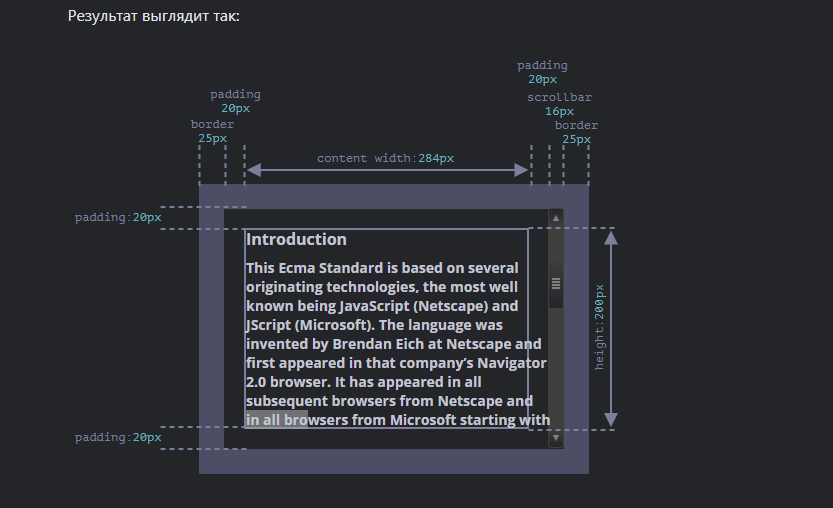
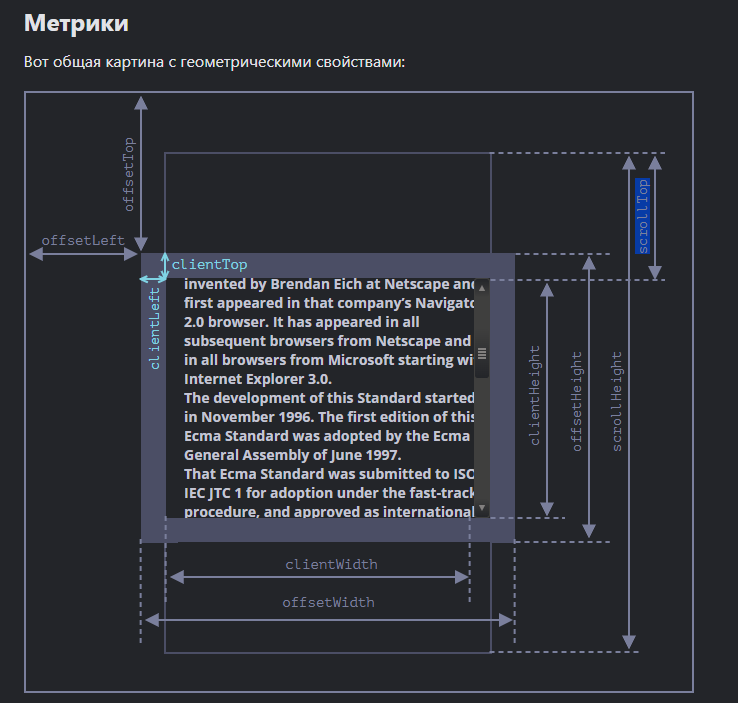
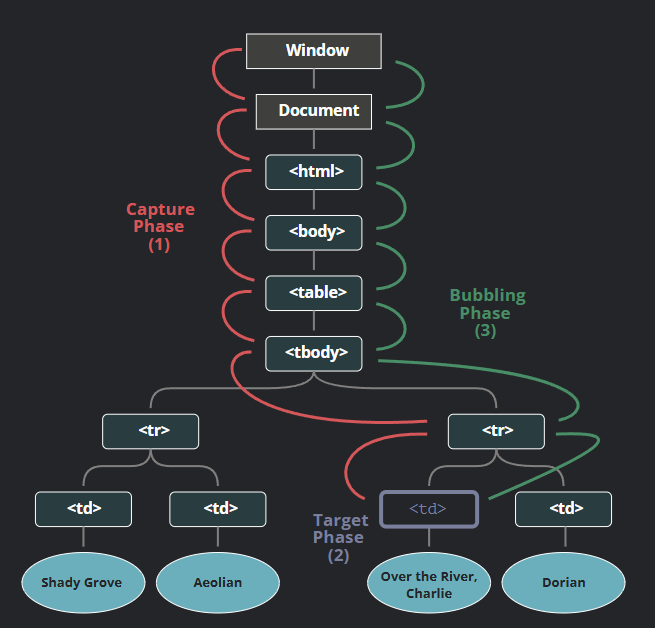

## Содержание

| №   | Вопрос                                                                                                                                         |
|-----|------------------------------------------------------------------------------------------------------------------------------------------------|
| 1   | [Система координат](#система-координат)     
| 2   | [Event bubbling и Event capturing](#event-bubbling-и-event-capturing)     

---

# Система координат

## В чем отличие систем координат относительно окна/документа/экрана? В каких случаях применять ту или иную систему координат?
```js
<div id="example">
  ...Текст...
</div>
<style>
  #example {
    width: 300px;
    height: 200px;
    border: 25px solid #E8C48F;
    padding: 20px;
    overflow: auto;
  }
</style>
```
 

### Относительно окна (viewport): vw hw (position: fixed)
> viewport - это координаты, которые изменяются от левого верхнего угла видимой части веб-страницы (от области, доступной для просмотра пользователм).
<br/> **Если страница была прокручена, координаты будут изменяться как далеко была прокручена страница**.

> - Используется, когда надо спозиционировать относительно видимой области окна.
> - При работе с событиями мыши. Например mousemove;

```clientX``` и ```clientY``` возвращают координаты относительно окна браузера.

### Относительно Document
> Это система координат относительно всего документа (всей страницы), включая скрытые области. **Position: absolute** если нет ближайшего элемента с position:relative.
> - Используется при вычислениях, напр. при расчёте положения элемента с учётом прокрутки.
> - Применяется в случаях, когда необходимо работать с элементами, которые могут быть вне видимой области экрана, например, при прокрутке страницы, когда нужно точно позиционировать элементы в документе.

> Чтобы вычислить координаты относительно документа - можно использовать ``getBoundingClientRect() + прокрутка страницы``
```js
const element = document.getElementById('myElement');
 window.addEventListener('scroll', () => {
      const rect = element.getBoundingClientRect();
      // Получаем координаты относительно документа
      const docTop = rect.top + window.pageYOffset;
      const docLeft = rect.left + window.pageXOffset;
      console.log(`Element's position relative to the document:`);
      console.log(`Top: ${docTop}, Left: ${docLeft}`);
    });
```

```pageX``` и ```pageY``` координаты относительно документа (включая прокрутку.


### Относительно экрана (screen). 
> Координаты относительно физического экрана устройства. От верхнего левого угла экрана юзера. Эти коорды независимы от окна браузера или документа.
> -  Используется при работе с событиями, касабщимися расположения относительно физ экрана. Например  создании всплывашек, меню или перемещение окна.
> - При перемещении или изменении размеров окон

```screenX``` и ```screenY``` возвращают координаты относительно всего экрана устройства, включая позицию мыши по отношению к экрану, а не только к окну браузера.

## Как получить размеры окна/документа?
> Размер окна - ``window.innerWidth, window.innerHeight`` - размеры только видимой части. А ```outerWidth и outerHeight``` - размеры всего окна, включая панели инструментов браузера, рамки, прокручиваемые полосы и т.д.

**Window.outerHeight - змеряет высоту самого окна браузера вместе с интерфейсом браузера!!!! (змеряет высоту самого окна браузера вместе с интерфейсом браузера)**
> Размер документа - ```document.documentElement.scrollHeight/scrollWidth``` c учётом невидимой из-за прокрутки части. <br/>
```document.documentElement.offsetWidth и document.documentElement.offsetHeight``` — показывают размеры документа, но без учёта прокрутки.

## Как получить координаты определенного элемента относительно окна/документа?
Использовать ``getBoundingClientRect()`` - это метод, который возвращает реальные размеры и позицию элемента на экране (с учётом его рендеринга, включая все текущие стили, трансформации и прокрутку).
> Относиительно окна:
```js
const element = document.querySelector("#foo"); 

const rect = element.getBoundingClientRect();

const elementTop = rect.top;    // Расстояние от верхней границы окна до верхней границы элемента
const elementLeft = rect.left;  // Расстояние от левой границы окна до левой границы элемента
const elementWidth = rect.width;  // Ширина элемента
const elementHeight = rect.height;  // Высота элемента
```

>Относительно документа надо учитывать прокрутку. Добавить window.scrollX и scrollY:
```js
const element = document.querySelector("#foo"); 
const rect = element.getBoundingClientRect();
const elementTop = rect.top + window.scrollY;  // Добавляем прокрутку по вертикали
const elementLeft = rect.left + window.scrollX; // Добавляем прокрутку по горизонтали
```

## Как программно прокрутить документ до определенного элемента?
Есть несколько вариантов:
- ``scrollTo()`` - принимает координаты. Т.е сначала их надо вычислить и затем передать.
```js
const element = document.querySelector("#foo");
const rect = element.getBoundingClientRect();

// Прокрутка к элементу
window.scrollTo({
  top: rect.top + window.scrollY,  // Учитываем прокрутку страницы
  left: rect.left + window.scrollX,  // Учитываем прокрутку по горизонтали
  behavior: 'smooth'  // Для плавной прокрутки
});
```

- scrollIntoView - удобнее, т.к автоматом высчитывает положение элеменнта и крутит туда.
```js
const element = document.querySelector("#foo");

// Прокрутка к элементу
element.scrollIntoView({
  behavior: 'smooth', // Плавная прокрутка
  block: 'start',     // Позиция элемента в области просмотра (можно использовать 'start', 'center', 'end', 'nearest')
});
```

``scrollTo`` - позволяет точно указать координаты прокрутки.

``scrollIntoView`` - удобнее, так как не нужно вычислять координаты вручную, и он автоматически прокручивает к элементу.

---

# Event bubbling и Event capturing
В DOM дереве все события проходят 3 фазы.
  1. Погружение (capturing phase) – событие сначала идёт сверху вниз.
  2. Фаза целевая. событие достигло целевого(исходного) элемента.
  3. Всплытие (bubbling stage) - событие пошло вверх по элемента. событие двигается от `event.target` вверх к корню документа, по пути вызывая обработчики, поставленные через on<event> и addEventListener без третьего аргумента или с третьим аргументом равным false.


> Чтобы перехватывать события при погружении, надо в ``addEventListener`` передать вторым аргументом true. Сокращение для
`{capturing: true}`.
```js
elem.addEventListener(..., {capture: true})
// или просто "true", как сокращение для {capture: true}
elem.addEventListener(..., true)
```
## Отличие event.target от event.currentTarget
- `event.target` – целевой элемент. не изменяется. самый глубокий элемент, на котором произошло событие. Т.е например если событие `click`,  то элемент, на который фактически кликнули.
- `event.currentTarget (this)` - изменяется. элемент, на котором в данный момент сработал обработчик (тот, на котором «висит» конкретный обработчик)

## Что такое делегирование DOM событий? Как и в каких случаях этим пользоваться?
Если у нас есть много одинаковых элементов, события на которых нужно обработать одинаково, то можно просто навесить обработчик на их родителя, а не вешать на каждый.
> Делегирование DOM-событий - это подход, когда вешается один обработчик не на каждый дочерний элемент отдельно, а на их общего предка, и потом внутри обработчика определяется, по какому именно элементу произошло событие.
Так, например, в React вешается один обработчик на рутовый элемент.

**Делегирование почти всегда использует фазу всплытия (bubbling)**.

Зачем нужно:
 - Вместо 1000 addEventListener на 1000 кнопок - один обработчик на контейнер. меньше когда
 - Удобно для списков, таблиц, меню
 ```html
 <ul id="todos">
  <li data-id="1"><button class="remove">Удалить</button></li>
  <li data-id="2"><button class="remove">Удалить</button></li>
</ul>

<script>
  const todos = document.getElementById('todos');

todos.addEventListener('click', (event) => {
  const removeBtn = event.target.closest('.remove');
  if (!removeBtn) return;

  const item = removeBtn.closest('li');
  if (!item) return;

  console.log('Удаляем item', item.dataset.id);
  item.remove();
</script>
 ```
 - Элементы создаются динамически (Например, чат, todo list, infinite scroll, результаты поиска.)

 ```js
 <!doctype html>
<body>
<div id="menu">
  <button data-action="save">Сохранить</button>
  <button data-action="load">Загрузить</button>
  <button data-action="search">Поиск</button>
</div>

<script>
  class Menu {
    constructor(elem) {
      elem.onclick = this.onClick.bind(this); // (*)
    }

    save() {
      alert('сохраняю');
    }

    load() {
      alert('загружаю');
    }

    search() {
      alert('ищу');
    }

    onClick(event) {
      let action = event.target.dataset.action;
      if (action) {
        this[action]();
      }
    }
  }

  new Menu(menu);
</script>
</body>
 ```