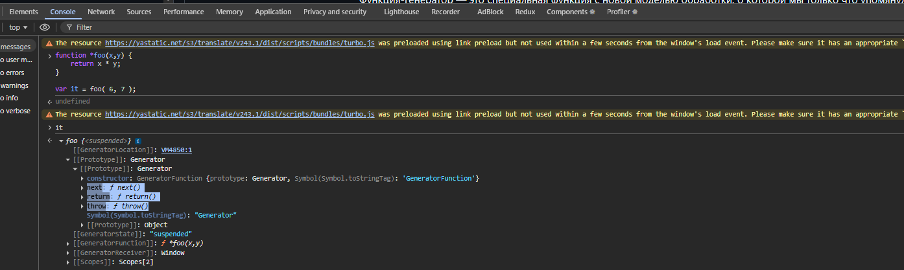
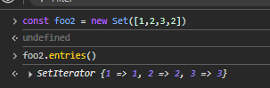
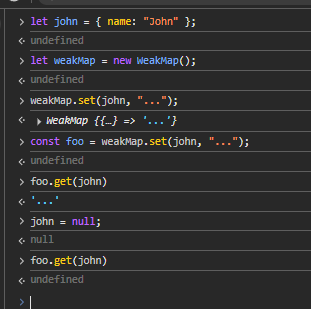

## Содержание

| №   | Вопрос                                                                                                                                         |
|-----|------------------------------------------------------------------------------------------------------------------------------------------------|
| 1   | [Итераторы и генераторы](#Итераторы-Генераторы)                                                  |
| 3   | [Set, Map](#set-map)                                                  |


---

# Итераторы Генераторы
## Что такое итерируемые объекты и итераторы?

**Итерируемые объекты** - это все объекты которые можно использовать в цикле ```for of ```. 
Массивы так же являются итрируемыми объектами. Но так строки тоже итерируемый объект. 

> **Итераторы** - **Symbol.iterator** - специальный встроенный `Symbol` созданный для итераций. То есть по нему можно проходиться в for...of, распаковывать через ..., собирать в Array.from()

> **Итератор** - объект с методом `next()`, который возвращает объект вида `{ value: any, done: true/false }`


Например чтобы сделать объект итерируемым:
```js
let range = {
  from: 1,
  to: 5
};
```
**обычные object намеренно не имеют итератора по умолчанию, в отличие от array**.
Нужно в него добавить метод с именем Symbol.iterator.
```js
range[Symbol.iterator] = function() {
    return {
        current: this.from,
        last: this.to,
        next(){
             if (this.current <= this.last) {
                return { done: false, value: this.current++ };
            } else {
              return { done: true };
            }
        }
    }
}
```
Теперь объект можно перебрать через цикл for...of:

1. Когда цикл запускается он вызывает один раз метод Symbol.iterator и этот метод должен вернуть **Итератор** - объект с методом next! 
2. дальше for...of работает только с этим объектом :
 ```js
  {
        current: this.from,
        last: this.to,
        next(){
             if (this.current <= this.last) {
                return { done: false, value: this.current++ };
            } else {
              return { done: true };
            }
        }
    }
```
3. Когда надо получить след. значение, вызывается next()
4. Если done === true, то цикл завершается. 

```js
var something = (function(){
	var nextVal;

	return {
		
		[Symbol.iterator]: function(){ return this; },

		// standard iterator interface method
		next: function(){
			if (nextVal === undefined) {
				nextVal = 1;
			}
			else {
				nextVal = (3 * nextVal) + 6;
			}

			return { done:false, value:nextVal };
		}
	};
})();

something.next().value;		// 1
something.next().value;		// 9
something.next().value;		// 33
something.next().value;		// 105
```
> Обратить внимание на `[Symbol.iterator]: function(){ return this; },` - ЭТО ТОЛЬКО ПРОТОКОЛ ДЛЯ ЦИКЛА FOR OF.

> Можно сделать бесконечный итератор. Например, range будет бесконечным при range.to = Infinity. 

```js
let str = "Hello";

// делает то же самое, что и
// for (let char of str) alert(char);

let iterator = str[Symbol.iterator](); // - получаем итератор с методом next()

while (true) {
  let result = iterator.next();
  if (result.done) break; // если next().done === true то итерация окончена
  alert(result.value); // выводит символы один за другим
}
```

Так же можно перебирать **Псевдомассивы** - объекты, у которых есть индексы и св-ва length. Например *NodeList*

> **Async Iterable** - чтобы сделать объект итерируемым асинхронно, надо использовать `Symbol.asyncIterator` вместо `Symbol.iterator`, 
next() - возвращает **Promise**.<br>
Чтобы такой объект перебрать, надо вызвать 
```js
for await (let item of iterable)
```

```js
let range = {
  from: 1,
  to: 5,

  // for await..of вызывает этот метод один раз в самом начале
  [Symbol.asyncIterator]() { // (1)
    // ...возвращает объект-итератор:
    // далее for await..of работает только с этим объектом,
    // запрашивая у него следующие значения вызовом next()
    return {
      current: this.from,
      last: this.to,

      // next() вызывается на каждой итерации цикла for await..of
      async next() { // (2)
        // должен возвращать значение как объект {done:.., value :...}
        // (автоматически оборачивается в промис с помощью async)

        // можно использовать await внутри для асинхронности:
        await new Promise(resolve => setTimeout(resolve, 1000)); // (3)

        if (this.current <= this.last) {
          return { done: false, value: this.current++ };
        } else {
          return { done: true };
        }
      }
    };
  }
};

(async () => {

  for await (let value of range) { // (4)
    alert(value); // 1,2,3,4,5
  }

})()
```
*Встроенные итерируемые объекты: String, Array, TypedArray, Map, Set*
## Зачем нужны итерируемые объекты, если уже есть массивы?
Помогает управлять перебором объектов более гибко. Массив это один из случаев итерируемого объекта.
Можно здавать свою логику обхода и перебора - графом, деревом и т.д.
## Генераторы. Где они могут пригодиться?
> Генераторы - функция function*, которую можно ставить на паузу и продолжать позже, при этом **выдаёт значения по одному**

3 ключевых факта:
1. function* — объявляет генератор.
2. Вызов генератора не выполняет код сразу. Он возвращает “объект-генератор”.
3. yield — это “верни значение наружу и поставь выполнение на паузу”.
```js
function* generateFoo(){
    yield 1;
    yield 2;
    yield 3;
    return 4
}
```
Когда такая ф-я вызывается, она не возвращает значение сразу, а возвращает объект **Генератор** для управления её выполнением.
```js
let generator = generateFoo(); // возвращает генератор с методом next()
alert(generator);   //[object Generator]

 for(let foo of generator){
        alert(foo) //1 2 3 4-НЕ ВЫВЕДЕТСЯ
}
        
/**
из-за того, что перебор через for..of игнорирует последнее значение, при котором done: true. 
Поэтому, если мы хотим, чтобы были все значения при переборе через for..of, 
то надо возвращать их через yield
 **/
```

```js
unction* generateSequence() {
  yield 1;
  yield 2;
  return 3;
}

let generator = generateSequence();

let one = generator.next();

alert(JSON.stringify(one)); // {value: 1, done: false}
```
**Применение** - Генераторы пригождаются там, где данные удобно “производить по одному”, а не держать всё в массиве.

Например:
- Обработка логов
- чтение больших файлов чанками
-  “пробеги по событиям → отфильтруй → преобразуй → возьми первые 100”. дабы не создавать arr.filter(...).map(...).slice(...)
- Если надо чтобы объект можно было использовать как Array/Set/Map
- Использовать spread [...]

>Генераторы нужны, когда удобно выдавать данные лениво: большие объёмы, бесконечные последовательности, обход деревьев, пайплайны без промежуточных массивов. Они дают удобный синтаксис итератора: yield возвращает элемент и сохраняет состояние. А для I/O и пагинации особенно полезны async generators с for await..of.

## В чём разница между перебором массива и итерируемого объекта через конструкции: for, for of, for in
1. **for..of** - Работает только через протокол iterator!  c итератором next(). Под капотом его вызывает.<br>
Массив итерируемый изначально. И так же у него есть индексы, length, методы для перебора.
    ```js
    const arr = ["a", "b", "c"];

    for (const v of arr) {
      console.log(v);
    }

    // Важно что тут нет перебора по индексу! Если он нужен, то нужен кортеж
    for (const [i, v] of arr.entries()) {
    console.log(i, v);
    }
    ```
  > Его минус в том, что мы не можем передать значение в next()
2. **for(...)** - ручной перебор. Тут мы сами указываем с чего начать, условие и каждый шаг. Легко обращаться к индексу. Работает быстро и предсказуемо
**Можно так же перебирать и итерируемые объекты, передавая значения в next()**
    > Нельзя перебрать произвольный iterable через for, потому что у iterable нет length и индексов. 
3. **for...in** — перебор ключей enumerable-свойств объекта. Про объектные св-ва
    ```js
    const arr = ["a", "b", "c"];
    for (const k in arr) {
      console.log(k, typeof k);
    }
    // "0" "string" - перебирает ключи индексы
    // "1" "string"
    // "2" "string"
    ```
    > ### Супер важный нюанс - for...in “захватывает” лишние свойства.
    ```js
    const arr = ["a", "b"];
    arr.extra = 123;

    for (const k in arr) console.log(k);
    // "0"
    // "1"
    // "extra"   <-- НЕ элемент массива
    // Из-за этого for...in для массивов почти всегда плохо.
    ```
Для перебора объектов надо делать проверку на то что это свойство этого объекта:
```js
for (const k in obj) {
  if (Object.prototype.hasOwnProperty.call(obj, k)) {
    console.log(k, obj[k]);
  }
}
```


## Методы объекта-генератора
Генератор-объект имеет: 
1. next(value?):
    - Возобновляет выполнение до следующего yield / return / конца
    - Возвращает {value, done}
    - Важный момент: value переданный в next(value) становится результатом предыдущего yield выражения внутри генератора.
2. throw(error):
    - “Вбрасывает” исключение в точку текущей паузы (как будто внутри генератора в месте yield произошёл throw)
```js
  function* worker() {
  try {
    yield "step 1";
    yield "step 2";           // ← если снаружи вызвать .throw(), исключение прилетит сюда (в текущую точку паузы)
    yield "step 3";
  } catch (e) {
    yield `caught: ${e.message}`; // генератор может “превратить” ошибку в значение
  }

  yield "after catch";
}

const it = worker();

console.log(it.next());            // { value: 'step 1', done: false }
console.log(it.next());            // { value: 'step 2', done: false }

// Вбрасываем ошибку ВНУТРЬ генератора:
console.log(it.throw(new Error("boom"))); // { value: 'caught: boom', done: false }

console.log(it.next());            // { value: 'after catch', done: false }
console.log(it.next());            // { value: undefined, done: true }
```
3. return(value):
    - Досрочно завершает генератор
    - Даёт возможность корректно закрыть генератор (в finally можно сделать cleanup)
```js
function* readWithCleanup() {
  console.log("open resource");
  try {
    yield "chunk-1";
    yield "chunk-2";
    yield "chunk-3";
  } finally {
    // Сработает при:
    // - естественном завершении
    // - generator.return(...)
    // - generator.throw(...)
    console.log("cleanup: close resource");
  }
}

const it = readWithCleanup();

console.log(it.next());
// open resource
// { value: 'chunk-1', done: false }

console.log(it.next());
// { value: 'chunk-2', done: false }

// Досрочно завершаем:
console.log(it.return("STOP"));
// cleanup: close resource
// { value: 'STOP', done: true }

console.log(it.next());
// { value: undefined, done: true }
```


------------------------
## Конспект [статьи](https://github.com/getify/You-Dont-Know-JS/blob/1st-ed/async%20%26%20performance/ch4.md)
1. Callback не заслуживают доверия и не поддаются компоновке из-за инверсии управления..
2. промисы устраняют инверсию управления в коллбэках, восстанавливая надёжность и компонуемость.

Генератор функция - функция которая не выполняется от начала до конца.
Например:
```js
var x = 1;

function foo() {
	x++;
	bar();				// <-- а что насчёт этой строки?
	console.log( "x:", x );
}

function bar() {
	x++;
}

foo();
```
### Почему в качестве ключевого слова используется именно yield?
-  в обычном JS “между двумя строками” внутри одной синхронной функции ничего само не вклинится, потому что JS выполняется по модели run-to-completion (пока стек не опустеет — event loop не подкинет другую задачу). Поэтому без bar() результат был бы 2.
- А вот “как сделать, чтобы что-то всё-таки могло выполниться между x++ и console.log?” — только если сама foo() добровольно отдаст управление наружу в этом месте. Это и есть cooperative (кооперативная) конкуррентность: никто тебя не прерывает силой, ты сам “вежливо уступаешь”.

Почему именно yield:
- Потому что yield по смыслу — “уступить / отдать”:
- уступить управление вызывающему коду (наружу),
- отдать промежуточный результат (value) наружу,
- и остановиться ровно в отмеченной точке.

```js
var x = 1;

function *foo() {
	x++;
	yield; // pause!
	console.log( "x:", x );
}

function bar() {
	x++;
}

// создаём итератор `it` для управления генератором
var it = foo();

// запускаем `foo()` здесь!
it.next();
x;						// 2
bar();
x;						// 3
it.next();				// x: 3
```
1. Операция it = foo() пока не запускает *foo() генератор, а лишь создаёт итератор, который будет управлять его выполнением.
2. Первый it.next() запускает генератор *foo() и выполняет x++ в первой строке *foo().
3. *foo() приостанавливается на операторе yield, после чего завершается первый вызов it.next() . В данный момент *foo() все еще выполняется и активен, но находится в состоянии приостановки.
4. Мы проверяем значение x, и теперь оно равно 2.
5. Мы вызываем bar(), который снова увеличивает x на x++.
6. Мы снова проверяем значение x, и теперь оно равно 3.
7. Последний вызов it.next() возобновляет работу генератора *foo() с того места, где он был приостановлен, и запускает оператор console.log(..), который использует текущее значение x из 3.


На скриншоте видно, что вызов генератор-функции не запускает её тело, а лишь создаёт “контроллер выполнения”.
Самое ключевое на скрине — строка:

`[[Prototype]]: Generator`

То есть it — обычный объект, который наследует методы из Generator.prototype (в DevTools он просто называется Generator).

Именно поэтому у it есть методы:
- `next` -  продвинуть выполнение до следующего yield/return и получить { value, done };
- `return` - досрочно завершить генератор (с переводом в done: true и выполнением finally, если он есть);
- `throw` - - вбросить исключение внутрь генератора в текущую точку паузы;

```js
function *foo(x) {
	var y = x * (yield);
	return y;
}

var it = foo( 6 );

// запуск `foo(..)`
it.next();

var res = it.next( 7 );

res.value;		// 42
```
> Внутри *foo(..) оператор var y = x .. начинает обрабатываться, но затем натыкается на выражение yield . <>
В этот момент он приостанавливает *foo(..) (в середине оператора присваивания!) и, по сути, запрашивает у вызывающего кода значение результата для выражения yield . 
Затем мы вызываем it.next( 7 ), который передаёт значение 7 обратно в be в качестве результата приостановленного выражения yield.
## next(..) может отправлять значения в приостановленное yield-выражение.!!!!
``` js
function *foo(x) {
	var y = x * (yield "Hello");	// <-- вернуть значение!
	return y;
}

var it = foo( 6 );

var res = it.next();	// первый вызов `next()`, ничего не передаем
res.value;				// "Hello"

res = it.next( 7 );		// передаем `7` ожидающему `yield`
res.value;				// 42
```
 Здесь всё ещё есть лишний next() по сравнению с количеством yield операторов. Таким образом, последний it.next(7) вызов снова задаёт вопрос о том, какое следующее значение выдаст генератор. Но больше нет yield операторов, на которые можно ответить, не так ли? Так кто же ответит?

Оператор return отвечает на вопрос!

И если в вашем генераторе нет return — return в генераторах точно так же не обязателен, как и в обычных функциях, — то всегда есть предполагаемый/неявный return; (он же return undefined;), который по умолчанию отвечает на вопрос поставленный последним вызовом it.next(7) .

```js
function *foo() {
	var x = yield 2;
	z++;
	var y = yield (x * z);
	console.log( x, y, z );
}

var z = 1;

var it1 = foo();
var it2 = foo();

var val1 = it1.next().value;			// 2 <-- yield 2
var val2 = it2.next().value;			// 2 <-- yield 2

val1 = it1.next( val2 * 10 ).value;		// 40  <-- x:20,  z:2
val2 = it2.next( val1 * 5 ).value;		// 600 <-- x:200, z:3

it1.next( val2 / 2 );					// y:300
										// 20 300 3
it2.next( val1 / 4 );					// y:10
										// 200 10 3
```
1. Оба экземпляра *foo() запускаются одновременно, и оба next() вызова отображают value of 2 из yield 2 инструкций соответственно.
2. val2 * 10 является 2 * 10, который отправляется в первый экземпляр генератора it1, так что x получает значение 20. z увеличивается с 1 на 2, а затем 20 * 2 редактируется yield, устанавливая val1 значение 40.
3. val1 * 5 является 40 * 5, который отправляется во второй экземпляр генератора it2, так что x получает значение 200. z снова увеличивается с 2 на 3, а затем 200 * 3 редактируется yield, устанавливая val2 значение 600.
4. val2 / 2 Это 600 / 2, которое отправляется в первый экземпляр генератора it1, так что y получает значение 300, а затем выводит 20 300 3 для своих x y z значений соответственно.
5. val1 / 4 Это 40 / 4, которое отправляется во второй экземпляр генератора it2, так что y получает значение 10, а затем выводит 200 10 3 для своих x y z значений соответственно.

**Вопрос с собеса - написать ф-ю, которая сохраняет и что-то делает промежуточное значение без замыкания**
```js
function *foo() {
	var nextVal;

	while (true) {
		if (nextVal === undefined) {
			nextVal = 1;
		}
		else {
			nextVal = (3 * nextVal) + 6;
		}

		yield nextVal;
	}
}

for (var v of foo()) {
	console.log( v );

	// не дайте циклу выполняться бесконечно!
	if (v > 500) {
		break;
	}
}
```
>**Вызов foo() возвращает итератор, но циклу for..of нужен итерируемый объект. У итератора генератора также есть функция Symbol.iterator, которая, по сути, выполняет return this. Другими словами, итератор генератора также является итерируемым объектом!**
## Итог:
**В JS итерация построена на протоколах. Iterable — это объект с Symbol.iterator, который возвращает iterator. Iterator — это объект с next(), возвращающим {value, done}. for...of работает именно с iterable, поэтому помимо массивов он умеет строки, Set, Map и любые кастомные источники, включая ленивые и бесконечные последовательности.
Асинхронная версия — Symbol.asyncIterator и for await...of, где next() возвращает Promise.
Генераторы function* упрощают написание итераторов: yield отдаёт значение и приостанавливает функцию. У генератора есть next/throw/return для управления продолжением, ошибками и ранним завершением. yield* — композиция, делегирует итерацию другому iterable. Async generators async function* дают поток данных с await внутри и удобны для стриминга и пагинации.**

# Set, Map
##  Set
Set - коллекция уникальных значений. Уникальность проверяется по алгоритму SameValueZero, почти как `===`, но с нюансами:
- NaN считается равным NaN
- `+0` и `-0` считаются одним и тем же.
### Как создать инстанс:
```js
const foo = new Set();
const foo2 = new Set([1,2,3,2]) // => {1,2,3}
const foo3 = new Set("hello");      // => {'h','e','l','o'}
```
### Какие методы существуют у инстанса?
Основные:
- add(value) → добавляет значение, возвращает сам set (можно чейнить)
- has(value) → true/false
- delete(value) → удаляет, возвращает true/false
- clear() → очищает
- size → свойство, количество элементов

Методы для итерации или представления:
- values() → итератор значений
- keys() → в Set это то же самое, что values() (исторически для совместимости с Map)
- entries() → возвращает перебираемый объект для пар вида [значение, значение], присутствует для обратной совместимости с Map
- [Symbol.iterator]() → то же, что entries()

- forEach((value, value2, set) => ...) → value2 там тоже будет value (для API-совместимости)
### Как можно перебрать?
- Т.к он итерируемы, то через `for...of`;
- `forEach` 
```js
foo.forEach(v => console.log(v));
```
- Через итераторы:
```js
[...s2.values()]   // массив значений
[...s2.entries()]  // [[v,v], ...]
```
### Может ли содержать одинаковые элементы?
Нет из-за алгоритма SameValueZero.
> SameValueZero - внутренний алгоритм сравнения "равенства" в спецификации JS. Он используется там, где нужна "уникальность"/"совпадение ключей" без некоторых странностей ===.

**Но важный edge case:**
```js
const s = new Set();
s.add({a: 1});
s.add({a: 1});
console.log(s.size); // 2 (разные объекты)

const s = new Set([NaN, NaN]);
console.log(s.size); // 1
```

### Где полезен Set в проде?
Там где надо хранить уникальные значения, например ids. Особенно удобно для UI-состояния “выбрано/не выбрано”.
--
> - Set не умеет “по значению” сравнивать объекты (только по ссылке). Для “уникальных объектов по id” обычно хранят id в Set, либо используют Map по id. <br>
> - Сериализация: JSON.stringify(new Set([1,2])) даст {} — нужно вручную: JSON.stringify([...set]). 

> **Set** - это коллекция уникальных значений. Дубли схлопываются по SameValueZero, поэтому NaN считается равным NaN, а объекты уникальны по ссылке. Основные операции: add, has, delete, clear, плюс size и итерация через for..of/forEach. В проде Set полезен для дедупликации и быстрого membership-check вместо includes, а также для пересечений/разностей множеств. Trade-off: Set не решает "уникальность объектов по структуре", там нужен ключ (например id) или Map.
## Map
Map - коллекция вида ключ:значение, где ключом может быть любое значение (даже объект или ф-я). Cравнение ключей так же происходит по алгоритму SameValueZero.
### Как создать инстанс?
```js
const m1 = new Map();

const m2 = new Map([
  ["a", 1],
  ["b", 2],
]);

const objKey = { id: 1 };
const m3 = new Map([[objKey, "value "]]);
```
### Методы инстанса Map:
- set(key, value) → кладёт/перезаписывает, возвращает map (чейнинг)
- get(key) → значение или undefined
- has(key) → true/false
- delete(key) → удаляет, true/false
- clear() → очищает
- size → свойство, количество пар
Для итерации:
 - keys() → итератор ключей
 - values() → итератор значений
 - entries() → итератор пар [key, value]
 - [Symbol.iterator]() → то же, что entries() (поэтому for..of даёт [k,v])
 - forEach((value, key, map) => ...)
### В чем отличие от обычного объекта?
1. Ключи:
- Ключ в Мапе - любой тип (объект, ф-я, дата, НАН)
- Ключ в объекте - строка или symbol (прочите типы к строке приводятся)
2. Безопасность ключей
- Мап нет проблем с прототипным мусора, т.к нет прототипной цепочки. Нет ___proto___
- Обычный пустой объект - объект с прототипной цепочкой. Наследует свойства из Object.prototype.
3. Размер
- Map.size - O(1) и прямой.
- Объект - нужно `Object.keys(obj).length` 
### Где Map полезен в проде?
- Кэш по объектному ключу (важнейший кейс) - Например, хранить метаданные по DOM-элементу.
```js
const meta = new Map();
meta.set(domNode, { seen: true, last: Date.now() });
```
- Быстрый lookup вместо поиска в массиве
```js
const byId = new Map(users.map(u => [u.id, u]));
byId.get(42);
```
---
> - get(key) возвращает undefined и когда ключа нет, и когда значение реально undefined — если важно различать, проверять has(key).
> - Память: Map держит сильные ссылки на ключи-объекты. Для “кэша, который не должен мешать GC” используют WeakMap (ключи только объекты, неитерируемый).

> **Map** - коллекция пар ключ–значение, где ключом может быть любой тип, включая объекты. Ключи сравниваются SameValueZero, поэтому NaN совпадает с NaN. Основные методы: set/get/has/delete/clear, свойство size, итерация через for..of, keys/values/entries и forEach. В отличие от обычного объекта, Map не ограничен строковыми ключами, безопаснее от прототипных коллизий, легче итерируется и удобнее для динамических вставок/удалений. Типичные применения — кэши, lookup-таблицы по id, счётчики, реестры обработчиков; для "не удерживать объекты в памяти" нужен WeakMap.

## WeakSet/WeakMap
WeakSet/WeakMap - то коллекции, которые не удерживают  объекты в памяти.
Если на объект больше нет сильных ссылок нигде в программе, GC может его собрать, и запись в Weak*-коллекции исчезнет автоматически.
### Что такое WeakMap
*WeakMap* - коллекция пар ключ:значение, НО!!! ключи - **только объекты**. Записи живут ровно пока живут ключи.
Создание:
```js
let john = { name: "John" };

let weakMap = new WeakMap();
weakMap.set(john, "...");

john = null; // перезаписываем ссылку на объект

// объект john удалён из памяти!
```

Методы: set, get, has, delete (нет clear, нет size, нет итерации).
*WeakSet* - множество объектов, которое не мешает GC собирать эти объекты
- Аналогично Set, но мы можем добавлять в WeakSet только объекты (не примитивные значения).
- Объект присутствует в множестве только до тех пор, пока доступен где-то ещё.
- Как и Set, он поддерживает add, has и delete, но не size, keys() и не является перебираемой.

```js
let visitedSet = new WeakSet();

let john = { name: "John" };
let pete = { name: "Pete" };
let mary = { name: "Mary" };

visitedSet.add(john); // John заходил к нам
visitedSet.add(pete); // потом Pete
visitedSet.add(john); // John снова

// visitedSet сейчас содержит двух пользователей

// проверим, заходил ли John?
alert(visitedSet.has(john)); // true

// проверим, заходила ли Mary?
alert(visitedSet.has(mary)); // false

john = null;

// структура данных visitedSet будет очищена автоматически (объект john будет удалён из visitedSet)
```
> **Weak нельзя использовать как "основное хранилище данных", потому что записи могут исчезнуть в любой момент после потери внешних ссылок.**
### Где могут быть полезны?
- Кэш, который не должен удерживать объекты
Классика: мемоизация вычислений по объекту:
```js
const cache = new WeakMap();

function heavyCompute(obj) {
  if (cache.has(obj)) return cache.get(obj);
  const res = /* дорого */;
  cache.set(obj, res);
  return res;
  /// Если obj больше нигде не нужен — GC заберёт и obj, и кэш.
}
```
- В основном, WeakMap используется в качестве дополнительного хранилища данных. Если мы работаем с объектом, который «принадлежит» другому коду, может быть даже сторонней библиотеке, и хотим сохранить у себя какие-то данные для него, которые должны существовать лишь пока существует этот объект, то WeakMap – как раз то, что нужно.

> WeakMap/WeakSet - коллекции, которые хранят только объекты и держат их слабо: если на объект больше нет сильных ссылок, GC может его собрать, и запись пропадёт. В отличие от Map/Set, у Weak* нет итерации, size и clear — поэтому их используют не как основное хранилище, а как метаданные/кэш/маркировку объектов без риска утечек. Типичные кейсы: приватные данные для экземпляров, мемоизация по объектным ключам, отметка "visited" при обходах и хранение данных по DOM-узлам.